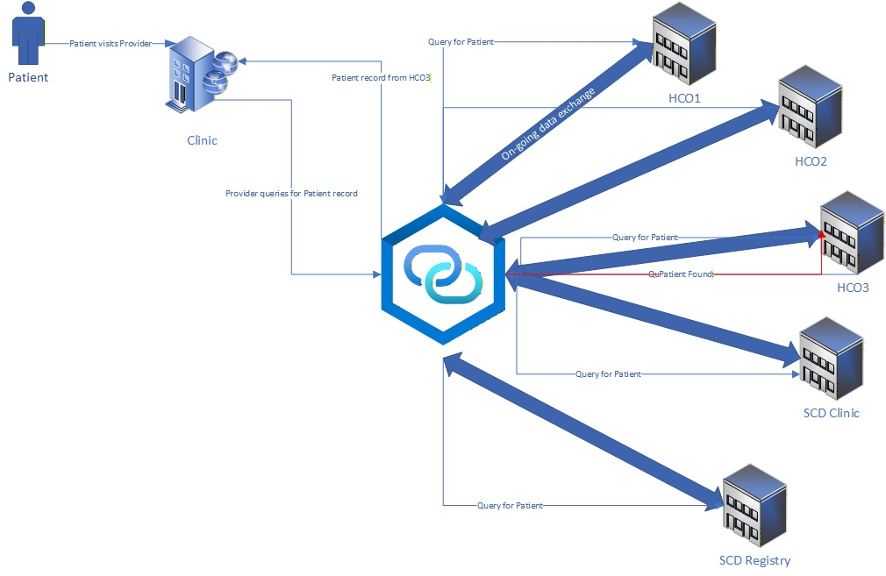


================================================================================
SCOPE AND USAGE PAGE — scope_and_usage.md


### Scope and Usage

### In Scope

The following use cases and data exchange scenarios are **in scope** for
this Implementation Guide:
Transfer of Care: An SCD patient transitions their care from one provider to another. The new provider creates or updates the SCD diagnosis of the patient.
Emergency Department: An SCD patient presents at an Emergency Department (ED) for immediate, critical care. The new provider retrieves the clinical information needed in order to provide appropriate care to the patient.

| # | Use Case | Key Profiles |
|---|---|---|
| 1 | SCD Diagnosis and Genotype Documentation | Condition (Problems), Patient, Practitioner, PractitionerRole, Organization, Vital Signs Observation |
| 2 | Acute Care Encounter (VOC, ACS) | Encounter, Condition (Encounter Dx), Laboratory Result Observation, MedicationRequest, CarePlan  |

This diagram illustrates the data exchange process flow tested for these use cases. When the SCD patient presents to a new provider for care, a query is initiated to locate the patient's EMR.  Once located, the necessary medical reord data is queried for and returned by the identified EHR.

---
 
### Out of Scope

The following items are explicitly **out of scope** for this first version of the
USCDI-SCD IG: All registry and research use cases.  

---

### Clinical Use Cases
Both Use Cases supported by this guide are Clinical Use Cases.

---

### Relationship to Other Implementation Guides
